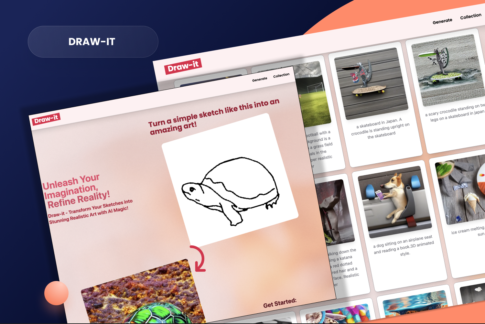

# [Draw-it Web 🔗](https://imagine-it.vercel.app/) 

## Introduction

Draw-it is an innovative web application designed to transform user doodles into realistic images through the power of artificial intelligence. This document outlines the key features and functionalities of Draw-it, which is built using the latest web technologies.

## Key Features

### Interactive Canvas

-   **ReactSketchCanvas**: Provides users with a responsive and intuitive canvas to doodle their images. The canvas is easy to use and works across all devices, ensuring a seamless drawing experience.

### AI-Enhanced Image Generation

-   **Replicate AI Integration**: Once a doodle is complete, users can submit a text prompt describing their drawing. Draw-it leverages the Replicate AI to interpret the doodle and the prompt to generate a realistic image that matches the user's description.

### Data Storage and Retrieval

-   **Convex Backend**: All doodles, prompts, and generated images are securely stored in the backend powered by Convex. This allows for efficient data management and retrieval.

### Community Collection

-   **Image Gallery**: Users can view and appreciate a collection of images generated by the community. This gallery serves as a showcase of creativity and the capabilities of the Draw-it app.

### User-Friendly Design

-   **Tailwind CSS**: The app boasts a clean and modern interface, meticulously designed using Tailwind CSS, ensuring a visually appealing and consistent user experience.
-   **ShadCN UI Library**: In addition to Tailwind CSS, the ShadCN UI library is utilized to give the application a unique look and feel, enhancing the overall interactivity of the app.

### Downloadable Content

-   **Image Download**: After image generation, users have the option to download their realistic images for personal use.

## Technologies Used

-   **Next.js 14**: A cutting-edge React framework that provides the backbone for the app, offering server-side rendering and static site generation functionalities.
-   **Convex**: A powerful backend solution for managing application data.
-   **Replicate AI**: An AI service that powers the image generation process, transforming doodles and text prompts into realistic images.
-   **Tailwind CSS**: A utility-first CSS framework used for designing the app's interface.
-   **ShadCN UI Library**: A set of UI components that complement Tailwind CSS and elevate the design of the app.

## Conclusion

Draw-it is a unique web application that combines user creativity with advanced AI technology to create an engaging and entertaining experience. It stands out with its interactive canvas, AI-powered image generation, and community-driven gallery. The app is designed to be both functional and visually appealing, ensuring that users have a delightful experience while unleashing their creativity.

For more information or to start doodling, visit the Draw-it web app today!